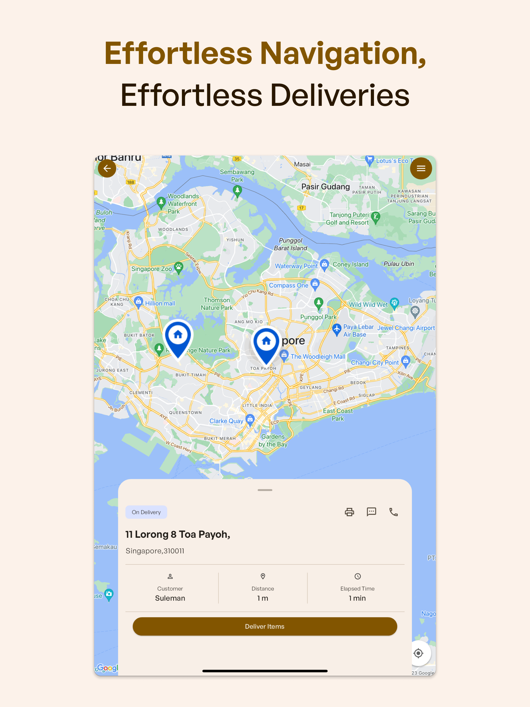

# Note
These commits are imported from bitbucket private repository.

# EVOLVE DELIVERY

This is an drivers task management app built using Flutter that communicates with an Odoo back-end using REST APIs. The app allows drivers to efficiently deliver orders, routing through google maps, and perform various operations related customer authorization like take signatures from customer when handing order to customer and take or upload photos.

## Screenshots

